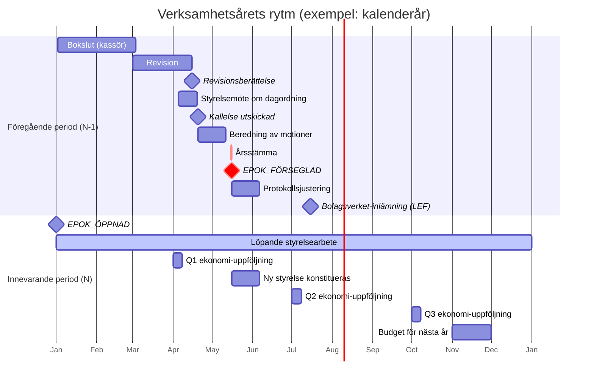

# Föreningen — årshjul, mötesplanering och minsta aktivitet

> Del av [Tillsammans-specifikation](../tillsammans.md).

Svenska ekonomiska föreningar — och i praktiken även ideala föreningar — följer räkenskapsåret slaviskt. Det är inte en valfri rytm; det är en konsekvens av bokföringslagen, LEF/LFS, Bolagsverket och Skatteverket som alla ställer tidskrav mätta från räkenskapsårets slut. Tillsammans ser därför årshjulet som föreningens grundtakt — allt stöd kring mötesplanering, påminnelser och minsta aktivitet organiseras runt det.

En viktig konsekvens av den lagbundna rytmen är att **styrelsen alltid lever i två perioder samtidigt** under de första 6–7 månaderna av nya året: den innevarande periodens löpande verksamhet och föregående periodens sigilleringsarbete. Hela designen nedan bygger på den dubbelheten.

**Relaterade dokument:**
- [granskningslogg.md](granskningslogg.md) — epok-modellen (räkenskapsår = epok)
- [core-concepts.md](core-concepts.md) — kallelsemodell, bordläggning
- [case-types.md](case-types.md) — motionens tidsfönster
- [roles/board-roles.md](roles/board-roles.md), [roles/oversight-roles.md](roles/oversight-roles.md), [roles/nominating-committee.md](roles/nominating-committee.md) — vilka roller är aktiva i vilka faser
- [legal-context.md](legal-context.md) — lagrum och tidsregler

## Tre nivåer av aktiv förening

Begreppet "aktiv" har flera betydelser. Tillsammans skiljer:

1. **Formellt aktiv** — juridiska existensen består (org-nummer registrerat, ingen likvidation). Lägsta nivån *"föreningen finns"*.
2. **Governance-aktiv** — ansvarsfrågan hanteras varje räkenskapsår, styrelse och revisor är på plats, stadgan är aktuell. Detta är vad Tillsammans kan observera och validera.
3. **Verksamhetsaktiv** — faktiska beslut fattas, pengar rör sig, ärenden hanteras. Ligger utanför granskningsloggens scope.

Tillsammans fokuserar på nivå 2. Minimum nedan är alltså "governance-aktiv-miniminivån". En förening som producerar färre händelser uppfyller inte lagens formkrav; en förening som producerar fler är välskött men inte *mer* aktiv i systemets mening.

## Räkenskapsåret som oavvikbar rytm

Varför kan en förening inte bara välja sitt eget tempo? Fyra drivkrafter:

| Lagkälla | Tvingande tidskrav |
|---|---|
| **Bokföringslagen** | Årsbokslut ska vara klart inom rimlig tid efter räkenskapsårets slut. |
| **LEF 6:14** | Ordinarie årsstämma ska hållas **inom 6 månader** från räkenskapsårets slut. |
| **LFS** | Samma 6-månaders-krav för samfälligheter. |
| **Bolagsverket** | Årsredovisning ska vara inkommen **inom 7 månader** efter räkenskapsårets slut för bokföringsskyldig LEF. |
| **Skatteverket** | Inkomstdeklaration enligt separat tidsschema. |

Varje tidskrav räknas *bakåt* från räkenskapsårets slut — och alla rör *föregående* period. Räkenskapsårets startdatum (kalender eller annat stadgebestämt fönster) är det enda föreningen väljer; när det är valt är resten låst.

Mötesplaneringen följer som en konsekvens: stämman för föregående period måste ligga senast månad 6 *in i nya perioden*, vilket betyder att revisionen måste vara klar senast månad 4–5, vilket betyder att bokslutet måste vara klart senast månad 2–3. Allt tidsrelaterat faller ut av den första valda datumgränsen — och pågår under tiden som styrelsen också driver nya periodens löpande verksamhet.

## Styrelsen lever i två perioder samtidigt

Vid varje tidpunkt under de första 6–7 månaderna av ett nytt räkenskapsår arbetar styrelsen parallellt i två perioder:

- **Innevarande period** (nya räkenskapsåret, epok N) — löpande verksamhet, nya beslut, nya ärenden, budgetutfall, styrelsemöten.
- **Föregående period** (det just avslutade räkenskapsåret, epok N−1) — bokslut, revision, kallelse till ansvarsfrihets-stämman, stämmans formella hantering, sigill.

Detta är inte en arkitekturritning — det är svensk föreningsverklighet. Myndigheternas tidskrav räknas *från räkenskapsårets slut*, vilket innebär att styrelsens juridiska arbete med föregående år pågår upp till 7 månader in i nya året. Under samma tid driver samma styrelse den nya periodens löpande verksamhet.

När `EPOK_FÖRSEGLAD` sätts på föregående period (normalt i anslutning till stämman, månad 5–6 av nya året) är föregående periods arbetsyta stängd. Kvar är bara innevarande period.

Tillsammans designas för denna dubbelhet:

- **Granskningsloggen skriver varje händelse till sin epok.** Ett beslut om nästa kvartals budget hör till innevarande epok; bokslutet för det föregående hör till föregående epok. Systemet håller isär dem automatiskt via event-metadata (`epoch_id`). Se [granskningslogg.md](granskningslogg.md).
- **Vyerna visar båda perioder under överlappsperioden.** Styrelsens arbetsyta har spår för *Innevarande* (default) och *Föregående* (sigilleringsarbetet). Efter sigill avvecklas föregående-spåret automatiskt.
- **Påminnelserna är period-märkta** så att styrelsen ser skillnaden mellan *"innevarande periods budgetöversyn"* och *"föregående periods revision bör vara klar om 14 dagar"*.
- **Rollen "ordförande" är densamma i bägge**, men *ansvarsfrihetsfrågan rör föregående periods styrelse*. Om sammansättningen ändrats loggar systemet korrekt via rolltilldelningarna som gällde under föregående period.

## Årshjulet — integrerat flöde

Följande illustration visar hur de två periodernas aktiviteter överlappar. Exemplet utgår från kalenderår (1/1–31/12); för fritidshus-säsong eller annat stadgebestämt räkenskapsår förskjuts datumen enligt stadgans inställning.



Diagrammet visar tre centrala observationer:

- **Parallelliteten.** Under månad 1–5 pågår bokslut–revision–stämmoberedning (föregående period) *samtidigt* som det löpande styrelsearbetet (innevarande period). Samma personer, två arbetsytor.
- **Sigillmilstolpen.** `EPOK_FÖRSEGLAD` och årsstämman sammanfaller — sigillet är stämmans beslut om ansvarsfrihet. Efter det är föregående-spåret avvecklat.
- **Efterarbetet sträcker sig förbi sigillet.** Protokollsjustering tillhör fortfarande föregående epok (som sluthändelse), medan Bolagsverket-inlämningen för LEF sker i innevarande epok med föregående års underlag.

Resten av sektionen går igenom varje tidspunkt i detalj med event-typer och epok-tillhörighet.

Tidsaxeln nedan räknas i månader *efter räkenskapsårets slut* (= start på innevarande period = epok N). För varje tidpunkt anges vad som pågår parallellt i bägge perioder.

### Månad 0 — räkenskapsåret skiftar

- **Innevarande (epok N):** `EPOK_ÖPPNAD` skrivs automatiskt. Nya budgeten som fastställdes av föregående stämma börjar gälla. Styrelsen fortsätter sitt löpande arbete — inget avbrott.
- **Föregående (epok N−1):** slutade igår. Kassören börjar avsluta böckerna. Epoken är tekniskt *öppen tills sigill*, så fler händelser (revisionskommunikation, stämmobeslut) kommer skrivas in.

### Månad 1–2

- **Innevarande:** Löpande styrelsemöten, nya ärenden inkommer, nya `STYRELSEBESLUT` skrivs. Budgetutfall för periodens första veckor kan följas.
- **Föregående:** **Kassören upprättar bokslut och balansräkning.** Eventuellt möte för att kvittera bokslutet innan överlämning till revisor — själva mötet är ett styrelsemöte i innevarande period, men beslutspunkten om bokslutet hör till föregående epok.

### Månad 2–3

- **Innevarande:** Löpande verksamhet fortsätter.
- **Föregående:** **Revisor granskar.** `REVISORSFRÅGA_STÄLLD` och `REVISORSSVAR_AVLÄMNAT` tillhör föregående epok eftersom de rör det året. Revisionsberättelsen färdigställs: `REVISIONSBERÄTTELSE_AVLÄMNAD` skrivs i föregående epok.

### Månad 3–4

- **Innevarande:** Styrelsen förbereder dagordning för kommande stämma vid ett styrelsemöte (ordinarie, innevarande-periods beslut). Motionsfönstret för föregående periodens stämma stängs (typiskt stadgebundet 2 v–1 mån före stämman). Valberedningen ([roles/nominating-committee.md](roles/nominating-committee.md)) färdigställer sitt samlade förslag.
- **Föregående:** `KALLELSE_UTSKICKAD` skrivs — formellt tillhör kallelsen *föregående* epok eftersom stämman avslutar den. Motioner som inkommit är `ÄRENDE_INLÄMNAT` i föregående epok.

### Månad 4–5 — beredning

- **Innevarande:** Löpande verksamhet. Beredning av motioner till stämman sker via innevarande periods styrelsemöten.
- **Föregående:** Styrelsens yttranden över motioner publiceras, tillhör föregående epok. Publik läsvy öppnas inför stämman (L6 tip-hash ingår).

### Månad 5–6 — ordinarie årsstämma

Stämmans formella genomförande är **lagens slutpunkt** för föregående period. Se [core-concepts.md](core-concepts.md), [meeting-roles.md](roles/meeting-roles.md) och granskningsloggens *"Praktiskt flöde"*.

- **Föregående:** **Alla stämmobeslut tillhör föregående epok.** Stämman avslutar den. Minsta uppsättning beslut som måste fattas:

  1. Val av mötesordförande, mötessekreterare, protokolljusterare, rösträknare.
  2. Godkännande av kallelsens formalia.
  3. Fastställande av årsredovisning.
  4. Ansvarsfrihet (beviljad / avslagen / uppskjuten).
  5. Val av styrelse (även om samma personer väljs om).
  6. Val av revisor (även om samma person väljs om).
  7. Val av valberedning.
  8. Beslut om eventuella motioner.

  `EPOK_FÖRSEGLAD` skrivs med sigill-variant beroende på ansvarsfrihetsutfallet. Därefter är föregående period read-only.

- **Innevarande:** Om nya styrelseledamöter valts tillträder de nu. `ROLL_TILLDELAD` skrivs i **innevarande** epok — de nya rollerna gäller framåt, inte bakåt.

### Månad 6–7 — efterarbete

- **Föregående:** Protokollet cirkuleras till justerare. `PROTOKOLL_JUSTERAT` tillhör föregående epok (stämmoprotokollets formella del). Tip-hash vid justering publiceras (L6).
- **Innevarande:** Nya styrelsen konstituerar sig (firmatecknare, utskott etc.) — `ROLL_TILLDELAD`, `FIRMATECKNINGSRÄTT_ÄNDRAD` i innevarande epok. För LEF: **årsredovisning inlämnas till Bolagsverket** senast månad 7 — registreras som `DOKUMENT_BIFOGAT` i innevarande epok (själva inlämningen är en nu-handling som refererar föregående periods underlag).

### Efter sigill

När `EPOK_FÖRSEGLAD` satts finns inga normala händelser kvar att skriva till föregående epok. Enda undantaget: `TILLÄGG_*`-addenda via de fem legitima vägar som beskrivs i [granskningslogg.md#retroaktiva-tillägg-addenda-till-stängd-epok](granskningslogg.md).

Styrelsens arbetsyta i UI avvecklar automatiskt föregående-spåret efter sigill — kvar finns en läsbar historisk vy, inte en aktiv arbetsyta.

### Löpande under hela året (innevarande period)

Mellan de fasta milstolparna driver styrelsen föreningen i vardagen. Dessa händelser tillhör alltid innevarande epok:

- **Styrelsemöten:** 4–8 per år är vanligt, minimum 1–2.
- **Ärenden:** motioner, medlemsansökningar, utläggsgodkännanden löpande.
- **Extra stämmor:** vid behov (stadgeändring, uteslutningsärende, styrelsens avsägande). Egen kallelsecykel (typiskt 1 v enligt LFS). Kan avgöra ärenden som rör innevarande period men kan också behandla frågor om föregående period innan den förseglats.
- **Kvartalsvis ekonomi-uppföljning:** inte lagkrav men starkt rekommenderat. Kassören rapporterar till styrelsen så att bokslutet inte blir en överraskning i månad 1.

## Minsta aktivitet per räkenskapsår

För att epoken ska kunna förseglas *korrekt* (inte med `STÄMMA_UTEBLEV`- eller `ANSVARSFRIHET_UPPSKJUTEN`-sigill) krävs följande minimum. Tabellen anger **vilken epok** varje händelse tillhör — avgörande eftersom stämmoåtgärder om ett år skrivs till det årets epok, även om själva stämman hålls månader senare.

| Händelse | Epok | Kommentar |
|---|---|---|
| `EPOK_ÖPPNAD` | N | Automatiskt vid räkenskapsårets start. |
| Löpande `STYRELSEBESLUT`, `ÄRENDE_*`, `UTLÄGG_*` | N | Innevarande periods vardag. |
| `KALLELSE_UTSKICKAD` (för stämma om föregående år) | N−1 | Kallelsen rör avslutandet av föregående period. |
| `MÖTE_ÖPPNAT` + `MÖTE_AVSLUTAT` för årsstämman | N−1 | Stämman avslutar föregående period. |
| `STÄMMOBESLUT` — val av mötesroller | N−1 | LEF 6:19, LFS 49§. |
| `STÄMMOBESLUT` — fastställande av årsredovisning | N−1 | Årsredovisningen är för föregående period. |
| `STÄMMOBESLUT` — ansvarsfrihet | N−1 | Frågan avser föregående styrelse. |
| `STÄMMOBESLUT` — val av styrelse/revisor/valberedning | N−1 | Valet protokollförs som del av föregående periods stämma. |
| `REVISIONSBERÄTTELSE_AVLÄMNAD` | N−1 | Avser föregående års granskning. |
| `PROTOKOLL_UPPRÄTTAT` + `PROTOKOLL_JUSTERAT` | N−1 | Stämmoprotokollet är föregående periods sluthändelse. |
| `EPOK_FÖRSEGLAD` | N−1 | Själva sigillet. |
| `ROLL_TILLDELAD` (ny styrelse efter stämman) | N | Nya rollerna börjar gälla nu. |
| `DEBITERINGSLÄNGD_FASTSTÄLLD` (samfällighet) | N−1 | Gäller föregående periods ekonomi. |
| `DOKUMENT_BIFOGAT` (Bolagsverket-inlämning, LEF) | N | Inlämningen är nu, även om underlaget är föregående. |

### Aktiva rolltilldelningar

Under hela innevarande period ska följande vara besatta:

- **Ordförande** — utan ordförande saknas signeringskapacitet och mötesledning.
- **Kassör** — utan kassör saknas ekonomisk kontroll.
- **Minst en revisor** — utan revisor kan ansvarsfrihet inte baseras på granskning. Revisorssuppleant är *inte* ett substitut — ordinarie måste finnas.
- **Stadgeenligt minimum-antal ledamöter** — LFS kräver minst 3, LEF minst 3 (6:1).

### Aktuell stadga

En `STADGEVERSION_ANTAGEN` måste vara i kraft. Vid föreningens första `EPOK_ÖPPNAD` måste stadgan ha antagits först.

## Edition-specifika tillägg till minimum

- **Samfällighet:** `DEBITERINGSLÄNGD_FASTSTÄLLD` per räkenskapsår är **lagkrav enligt LFS** och tillhör den epok debiteringslängden avser (normalt föregående).
- **LEF:** årsredovisningen ska inlämnas till Bolagsverket för bokföringsskyldig förening. Inlämningen är en nu-händelse i innevarande epok; underlaget är föregående periods.

## Räkenskapsårs-varianter

Empiriska mönster för de editioner Tillsammans täcker:

| Variant | Årscykel | Förekomst |
|---|---|---|
| **Kalenderår** (1/1–31/12) | Föregående periods bokslut jan–feb, revision feb–mar, stämma mar–apr | Dominerande hos samfälligheter och LEF |
| **Fritidshus-säsong** (1/5–30/4) | Föregående periods bokslut maj–jun, revision jun–jul, stämma jul–aug | Sommarstuge-samfälligheter — stämma i augusti då sommarboende är på plats |
| **Augusti-augusti** | Bokslut aug–sep, stämma i augusti | Vissa kust-samfälligheter (Rörumstrand) |

Edition-onboarding föreslår variant baserat på föreningstyp; stadgan bestämmer slutgiltigt.

## Aktivitetsstatus — härledning från loggen

Tillsammans härleder föreningens aktivitetsstatus direkt ur granskningsloggen. Statusen sammanfattar tillståndet över *båda* perioder: senaste förseglade epok (föregående) och innevarande öppna epok.

| Status | Senaste förseglade epok | Innevarande epok |
|---|---|---|
| **Aktiv** | `ANSVARSFRIHET_BEVILJAD` eller `AVSLAGEN` | Löpande utan kritiska vakanser |
| **Pending** | Inte relevant ännu (mellan stämmor) | Löpande utan kritiska vakanser |
| **Vilande** | `ANSVARSFRIHET_UPPSKJUTEN` | Löpande (men med påminnelse-flagga) |
| **Stadgebrott** | `STÄMMA_UTEBLEV` eller | Kritisk vakans > stadgad tidsgräns |
| **Nystartad** | — | Första epoken pågår (mjukare flaggor) |
| **Under avveckling** | — | Upplösnings-process påbörjad |

Statusen visas:

- I styrelsevyn med åtgärdsförslag (*"Ordförande-vakans i 72 dagar — överväg extra stämma"*).
- I medlemmens publika vy som status-etikett (*"Aktiv 2026"* / *"Vilande"* / *"Stadgebrott föreligger"*).
- I revisorns vy med prioriterade granskningspunkter.
- I den publika tip-hash-publiceringen (sigill-varianter är synliga för alla).

## Systemets mötesplanerings-stöd

### Årshjul-planerare

Vid onboarding konfigurerar föreningen räkenskapsår + stadgans kallelsetider. Systemet beräknar och visualiserar årshjulet med båda spåren:

- Innevarande-periodens löpande takt (rekommenderade styrelsemöten, kvartalsuppföljning).
- Föregående-periodens sigilleringsflöde (bokslutsdatum, revisionsdeadline, kallelsefönster, stämmoperiod).

Styrelsen kan justera specifika datum inom lagens ramar. Årshjulet lagras som konfiguration — inte som händelser — men händelser valideras mot det.

### Påminnelser — märkta per period

Påminnelser är alltid taggade `[Innevarande]` eller `[Föregående]` så att styrelsen inte blandar ihop vardagsdrift och sigilleringsarbete.

| Tidspunkt | Period | Påminnelse |
|---|---|---|
| 90 dagar före stämma | Föregående | Kallelsefönster öppnas; styrelsemöte om dagordning kan planeras |
| 60 dagar före | Föregående | Revisor: revisionsarbetet bör påbörjas |
| 45 dagar före | Föregående | Kassör: bokslut bör vara klart |
| 30 dagar före | Föregående | Styrelsemöte för att fastställa kallelse |
| Stadgans min-gräns före | Föregående | Kallelse måste skickas nu |
| 7 dagar efter stämma | Föregående | Protokollsjustering bör påbörjas |
| Löpande | Innevarande | Kvartalsuppföljning av ekonomi; kommande styrelsemöten; ärenden som nått deadline |

Påminnelserna skickas till berörda roller i deras arbetsyta, inte via extern e-post. Revisorn har egna påminnelser i sin arbetsyta.

### Vakans-flaggor

- **Kritisk vakans** (ordförande, kassör, revisor) > 60 dagar → röd flagga i styrelsevyn. Gäller innevarande period.
- **Mindre vakans** (sekreterare, suppleant, valberedningsledamot) → gul flagga.
- Flaggan visas tills rollen besätts eller stadgeändring tar bort den.

## Historisk läsrätt efter mandatet

Föreningen består längre än enskilda mandatperioder, men varje förtroendevalds juridiska ansvar sträcker sig bortom det aktiva uppdraget. En tidigare ordförande, kassör eller ledamot kan år efter mandatets slut bli föremål för klandertalan, skadeståndsfråga eller upphävd ansvarsfrihet. De måste då kunna försvara sig — och det kräver tillgång till underlaget.

### Grundprincip: läsrätt kvarstår permanent för egna epoker

Varje förtroendevald — ordförande, vice ordförande, sekreterare, kassör, ledamot, suppleant, revisor, revisorssuppleant, valberedningsledamot, valberedningens sammankallande — har **permanent läsrätt** till de epoker de var aktiva under. De ser samma arbetsyta som de såg då (styrelse-, revisor- eller valberednings-yta beroende på roll), inte begränsat till det som var publikt för medlemmarna.

**Frysning vid mandatets slut.** Inga händelser skrivna *efter* mandatets upphörande är synliga. Vyn är "fryst" vid `mandateEndsAt`.

**Undantag — addenda och rättelser.** Om en `TILLÄGG_*`-händelse eller rättelse-post skrivs som rör en epok personen var aktiv i (t.ex. klandertalan, upphävd ansvarsfrihet, retroaktiv bokslutsrättelse), ska tillägget vara synligt även om det skrevs långt efter mandatet. Det rör personen direkt.

**Aldrig skrivrätt.** Läsrätt enbart. Eventuella uttalanden eller rättelsebegäran lämnas via normala kanaler — motion om personen fortfarande är medlem, direktkontakt med styrelsen annars.

**GDPR-gallring respekteras.** Gallrad data är borta även för tidigare förtroendevalda. De ser metadata + `innehålls_hash` men inte innehåll. Se [granskningslogg.md#bilagor](granskningslogg.md#bilagor).

**Personlig exponerings-vy är permanent.** Varje förtroendevalds egna spår (röster, reservationer, jävsdeklarationer) i epoker de var aktiva i kvarstår oförändrat efter mandatet. Vyn är deras personliga juridiska dokumentation om ansvarsfrågan senare aktualiseras. Se [core-concepts.md#reservation-och-solidariskt-ansvar](core-concepts.md#reservation-och-solidariskt-ansvar).

### När läsrätten upphör

`readAccessEndsAt` är normalt `null` (obegränsad) men sätts explicit i tre fall:

- **Uteslutning som medlem av allvarliga skäl** (grov misskötsel, brottsligt handlande som rör föreningen). Uteslutningsbeslutet kan sätta `readAccessEndsAt = uteslutnings_datum` för personens historiska rolltilldelningar. Juridiskt försvar hanteras då via rätten till protokollsutdrag enligt föreningsrätt, inte fortsatt systemåtkomst.
- **GDPR-rättsgrundad radering** där lagrum medger och föreningens granskningsbehov inte övertrumfar. Varje fall kräver styrelsebeslut med rättslig motivering, loggat som egen händelse. Extraordinärt fall.
- **Förening upplöst.** Efter avveckling finns ingen förening att ha åtkomst till.

### Notifiering

När en `TILLÄGG_*` eller rättelse-post rör en epok där en person var aktiv förtroendevald notifieras personen via sin registrerade kanal (e-post om den finns, annars i den personliga vyn vid nästa inloggning). Rättssäkerheten förutsätter att de får veta att något händer som rör deras tid — att läsa i tidningen om en pågående klandertalan mot egen gammal styrelse är en miss av systemet.

### Teknisk referensmodell

```
RoleAssignment
  person_id
  role_type                 (ordförande, kassör, revisor, valberedningsledamot, …)
  epoch_ids_active_in       vilka epoker rollen var aktiv
  mandateStartsAt
  mandateEndsAt
  readAccessEndsAt          normalt null; sätts vid uteslutning / GDPR / upplösning
  notification_channel      för addenda-notifieringar
```

Access-kontrollen: *"visa händelser inom `epoch_ids_active_in` som har `at <= mandateEndsAt`, plus addenda och rättelse-poster till dessa epoker oavsett datum, under förutsättning att `readAccessEndsAt IS NULL OR now < readAccessEndsAt`"*.

Principen är tvärgående över alla förtroendevalda roller. RBAC-konsekvenser per roll nämns kort i respektive [roles/](roles/)-fil.

## Avvikelser — systemet flaggar, blockerar aldrig

Om föreningen underproducerar i förhållande till minimum:

- Händelser kan fortfarande skrivas (systemet är inte självhämmande).
- Epoken får ett sigill som reflekterar verkligheten (`STÄMMA_UTEBLEV`, `ANSVARSFRIHET_UPPSKJUTEN`).
- Statusen förändras i publika och interna vyer.
- Revisorn får prioriterade varningar.
- Nästa års planering startar med kvardröjande flaggor från förra årets brister.

Signaler tolkas enligt [analysis-rules.md#diagnostiska-signaler](analysis-rules.md) — en av tre rot-orsaker (engagemang, system-miss, CX/UX). Per [policy 8](mission.md#grund-policies) pekar signalerna på var problemet ligger, aldrig ut vem.

## Vad som uttryckligen *inte* är minimum

För att undvika rolförvirring:

- **Flera styrelsemöten per år.** Ett, eller inget mellan stämmorna räcker juridiskt om stadgan tillåter.
- **Motioner.** Ingen måste lämnas in.
- **Utläggs-, faktura- eller betalningsflöden.** Vissa föreningar har knappt ekonomi.
- **Anslagstavla-aktivitet.**
- **Utskott eller kommittéer.**
- **Publikations-disciplin utöver lagkravet** (men verifikationsrapporterna visar att bristande publicering är en tydlig "passiv erosion"-signal — se [threats.md](threats.md)).

En förening som bara gör minimum är formellt korrekt — inte nödvändigtvis väl driven. Skillnaden är observerbar (få händelser per år) men inte disciplinär från systemets håll.

## Öppna frågor

- **Styrelsens konstituering** — val av kassör, sekreterare: stämmans eller styrelsens beslut? Olika stadgar löser det olika. När beslutet tas av styrelsen efter stämman hör händelsen till innevarande epok; när stämman gör det hör den till föregående. Förslag: systemet tillåter bägge; onboarding-wizarden sätter default per edition.
- **Tidsfönster för kritisk vakans** innan röd flagga utlöses? Förslag: 60 dagar för ordförande/kassör, 90 dagar för revisor. Stadgan kan justera.
- **Verksamhetsberättelse som krav för epok-sigill?** Formellt krav finns för LEF men inte alltid för ideal förening. Förslag: krav för LEF-edition, rekommendation för övriga.
- **Nystartad-tröskel** — de första 12 månaderna eller första epoken till ansvarsfrihet? Förslag: första epoken fram till och med dess `EPOK_FÖRSEGLAD`.
- **Påminnelse-kanal.** I MVP bara i systemets arbetsytor? Eller även via e-post som opt-in? Förslag: MVP bara i arbetsytor, e-post är senare utvidgning.
- **Årshjul-justering mid-år.** Om stadgan ändras och kallelsetiden förändras under pågående år — hur uppdateras årshjulet? Förslag: aktiveras vid nästa epok; nuvarande epok behåller sitt fastställda schema.
- **Vy-växling mellan perioder.** Hur tydligt ska UI skilja innevarande från föregående arbete? Förslag: separat flik i styrelsevyn under överlappsperioden; föregående-fliken försvinner automatiskt efter sigill.
